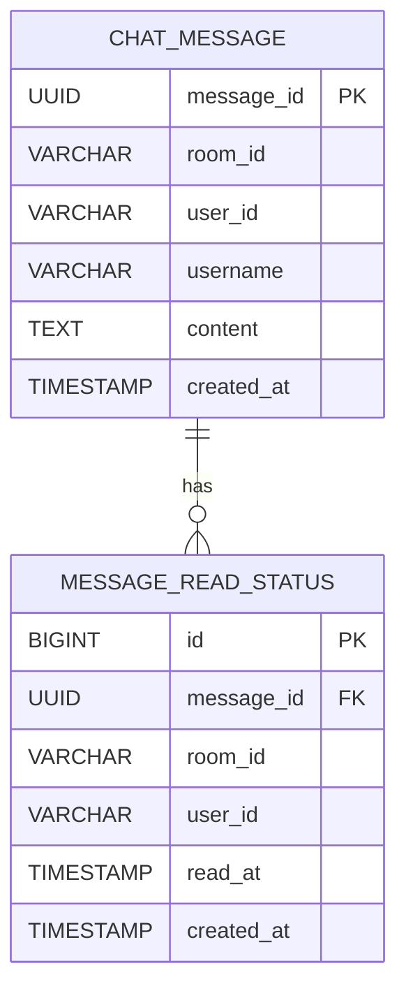
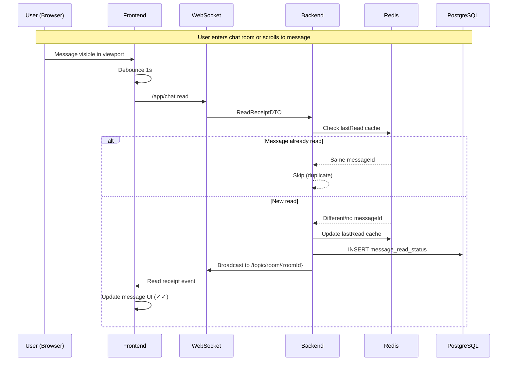
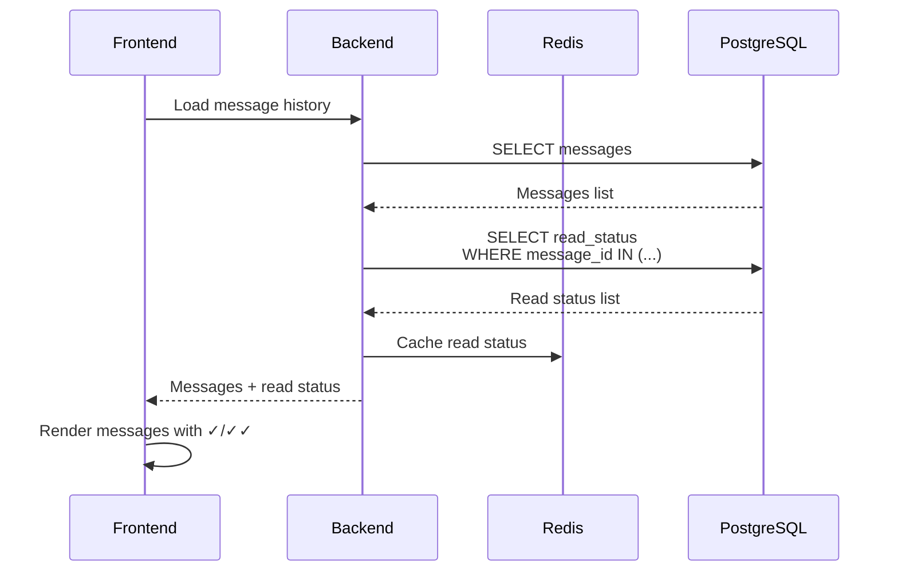
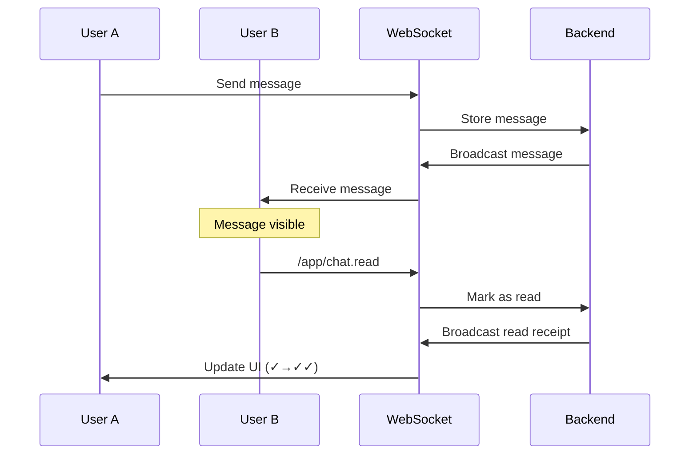

# Phase 6: Read Receipts (읽음 표시)

**목표**: 메시지 읽음 상태를 추적하고 시각적으로 표시

## 요구사항

### 기능 요구사항

1. **읽음 상태 추적**
   - 각 사용자가 마지막으로 읽은 메시지 ID 저장
   - 사용자가 채팅방을 보고 있을 때 자동으로 읽음 처리
   - 실시간으로 다른 사용자들에게 읽음 상태 브로드캐스트

2. **UI 표시**
   - 본인 메시지에만 읽음 표시
   - 체크마크 아이콘:
     - 전송됨 (회색 ✓)
     - 읽음 (파란색 ✓✓)
   - 읽은 사람 수 표시 (선택적)

3. **성능 최적화**
   - 읽음 이벤트 디바운싱 (1초)
   - PostgreSQL에 영구 저장
   - Redis에 최근 읽음 위치 캐싱

### 비기능 요구사항

- **정확성**: 읽음 상태가 정확하게 동기화
- **성능**: 읽음 이벤트가 메시지 전송 성능에 영향 없음
- **확장성**: 1000명 동시 접속 시에도 정상 작동

## 아키텍처

### 데이터베이스 스키마

#### PostgreSQL: message_read_status

```sql
CREATE TABLE message_read_status (
    id BIGSERIAL PRIMARY KEY,
    message_id UUID NOT NULL,
    room_id VARCHAR(100) NOT NULL,
    user_id VARCHAR(100) NOT NULL,
    read_at TIMESTAMP NOT NULL DEFAULT CURRENT_TIMESTAMP,
    created_at TIMESTAMP NOT NULL DEFAULT CURRENT_TIMESTAMP,

    CONSTRAINT uk_message_user UNIQUE (message_id, user_id)
);

CREATE INDEX idx_message_read_room_user ON message_read_status(room_id, user_id);
CREATE INDEX idx_message_read_message ON message_read_status(message_id);
```

**설계 결정**:
- `message_id` + `user_id` 복합 유니크 키: 중복 방지
- `room_id` + `user_id` 인덱스: 사용자별 읽음 메시지 조회 최적화
- `message_id` 인덱스: 특정 메시지의 읽은 사람 조회 최적화

### Redis 캐시

```
Key: room:{roomId}:lastRead:{userId}
Type: String (messageId)
TTL: 3600 seconds (1 hour)
Value: "550e8400-e29b-41d4-a716-446655440000"
```

**용도**:
- 사용자의 마지막 읽음 위치 빠른 조회
- 읽음 이벤트 중복 방지
- DB 쿼리 부하 감소

### WebSocket 이벤트

#### 클라이언트 → 서버

**Endpoint**: `/app/chat.read`

**Payload**:
```json
{
  "roomId": "general",
  "userId": "user-123",
  "messageId": "550e8400-e29b-41d4-a716-446655440000",
  "timestamp": "2024-01-22T10:30:00"
}
```

#### 서버 → 클라이언트

**Topic**: `/topic/room/{roomId}`

**Payload**:
```json
{
  "messageId": "550e8400-e29b-41d4-a716-446655440000",
  "userId": "user-123",
  "readAt": "2024-01-22T10:30:00"
}
```

## ERD (Entity Relationship Diagram)



**관계**:
- 하나의 메시지는 여러 사용자에게 읽힐 수 있음 (1:N)
- `message_id`는 `chat_message` 테이블의 외래키 (논리적)

## 시퀀스 다이어그램

### 1. 메시지 읽음 처리



### 2. 메시지 전송 시 읽음 상태 조회



### 3. 실시간 읽음 상태 업데이트



## 데이터 모델

### Backend DTO

#### ReadReceiptDTO.java

```java
@Data
@Builder
@AllArgsConstructor
@NoArgsConstructor
public class ReadReceiptDTO {
    @NotBlank
    private String roomId;

    @NotBlank
    private String userId;

    @NotNull
    private UUID messageId;

    @JsonFormat(pattern = "yyyy-MM-dd'T'HH:mm:ss")
    private LocalDateTime timestamp;
}
```

#### MessageReadStatusEntity.java

```java
@Entity
@Table(name = "message_read_status")
@Data
@Builder
@AllArgsConstructor
@NoArgsConstructor
public class MessageReadStatus {
    @Id
    @GeneratedValue(strategy = GenerationType.IDENTITY)
    private Long id;

    @Column(name = "message_id", nullable = false)
    private UUID messageId;

    @Column(name = "room_id", nullable = false, length = 100)
    private String roomId;

    @Column(name = "user_id", nullable = false, length = 100)
    private String userId;

    @Column(name = "read_at", nullable = false)
    private LocalDateTime readAt;

    @Column(name = "created_at", nullable = false, updatable = false)
    @CreationTimestamp
    private LocalDateTime createdAt;
}
```

### Frontend Types

```typescript
// Read receipt event
export interface ReadReceipt {
  messageId: string
  userId: string
  readAt: string
}

// Extended message with read status
export interface Message {
  messageId: string
  // ... other fields
  readBy?: string[]  // List of userIds who read this message
  readCount?: number // Number of users who read
}
```

## UI 설계

### 메시지 읽음 표시

```
┌─────────────────────────────────────┐
│  Alice                              │
│  Hello! How are you?                │
│                         10:30 ✓✓    │ ← 파란색 (읽음)
└─────────────────────────────────────┘

┌─────────────────────────────────────┐
│  Alice                              │
│  Are you there?                     │
│                         10:31 ✓     │ ← 회색 (전송됨)
└─────────────────────────────────────┘
```

### 읽은 사람 표시 (선택적)

```
┌─────────────────────────────────────┐
│  Alice                              │
│  Meeting at 3pm?                    │
│  Read by: Bob, Charlie     10:30    │
└─────────────────────────────────────┘
```

## 구현 계획

### Phase 6.1: Backend

1. **Database Schema**
   - Flyway migration 생성
   - `message_read_status` 테이블 생성

2. **Entity & Repository**
   - `MessageReadStatus` 엔티티
   - `MessageReadStatusRepository`

3. **Service Layer**
   - `ReadReceiptService` 인터페이스
   - `ReadReceiptServiceImpl` 구현
   - Redis 캐싱 로직

4. **WebSocket Handler**
   - `@MessageMapping("/chat.read")` 추가
   - 읽음 상태 저장 및 브로드캐스트

### Phase 6.2: Frontend

1. **Types & DTOs**
   - `ReadReceipt` 인터페이스
   - `Message` 타입 확장

2. **Composable**
   - `useReadReceipts` composable
   - 자동 읽음 처리 (Intersection Observer)
   - 디바운싱 (1초)

3. **UI Components**
   - `ReadReceiptIcon.vue` - 체크마크 아이콘
   - `MessageBubble.vue` 업데이트 - 읽음 상태 표시

4. **Integration**
   - 메시지 로드 시 읽음 상태 포함
   - 실시간 읽음 이벤트 처리

## 성능 최적화

### 1. 디바운싱

클라이언트에서 1초 디바운싱으로 읽음 이벤트 전송 최소화:

```typescript
const markAsRead = debounce((messageId: string) => {
  socket.send('/app/chat.read', { messageId, userId, roomId })
}, 1000)
```

### 2. 배치 처리

여러 메시지를 한 번에 읽음 처리:

```typescript
const markMessagesAsRead = (messageIds: string[]) => {
  // Send only the latest messageId
  const latestMessageId = messageIds[messageIds.length - 1]
  socket.send('/app/chat.read', { messageId: latestMessageId, ... })
}
```

### 3. Redis 캐싱

- 마지막 읽음 위치 캐싱으로 DB 쿼리 감소
- TTL 1시간으로 메모리 효율성 유지

### 4. 인덱스 최적화

- `(room_id, user_id)` 복합 인덱스로 조회 성능 향상
- `message_id` 인덱스로 읽은 사람 조회 최적화

## 테스트 계획

### Backend Tests

1. **Unit Tests**
   - `ReadReceiptService` 테스트
   - Redis 캐싱 로직 테스트
   - 중복 읽음 방지 테스트

2. **Integration Tests**
   - WebSocket 핸들러 테스트
   - DB 저장 및 조회 테스트

### Frontend Tests

1. **Composable Tests**
   - `useReadReceipts` 로직 테스트
   - 디바운싱 테스트

2. **Component Tests**
   - `ReadReceiptIcon` 렌더링 테스트
   - 상태 변화 테스트

### E2E Tests

1. 메시지 전송 후 읽음 표시 확인
2. 여러 사용자 읽음 상태 동기화
3. 페이지 새로고침 후 읽음 상태 유지

## 보안 고려사항

1. **권한 검증**: 사용자는 자신의 읽음 상태만 업데이트 가능
2. **입력 검증**: `messageId`, `userId` 유효성 검사
3. **Rate Limiting**: 과도한 읽음 이벤트 방지

## 확장 가능성

### Phase 6.3 (선택적)

1. **읽은 사람 목록**: 메시지를 누가 읽었는지 표시
2. **읽지 않은 메시지 수**: 채팅방 목록에 배지 표시
3. **마지막 읽은 위치**: 채팅방 재입장 시 스크롤 위치 복원
4. **Push 알림**: 읽지 않은 메시지 알림

## 마일스톤

- [x] 설계 문서 작성
- [ ] Backend 구현 (DB, Service, WebSocket)
- [ ] Frontend 구현 (Composable, UI)
- [ ] 통합 테스트
- [ ] 문서화 및 커밋
