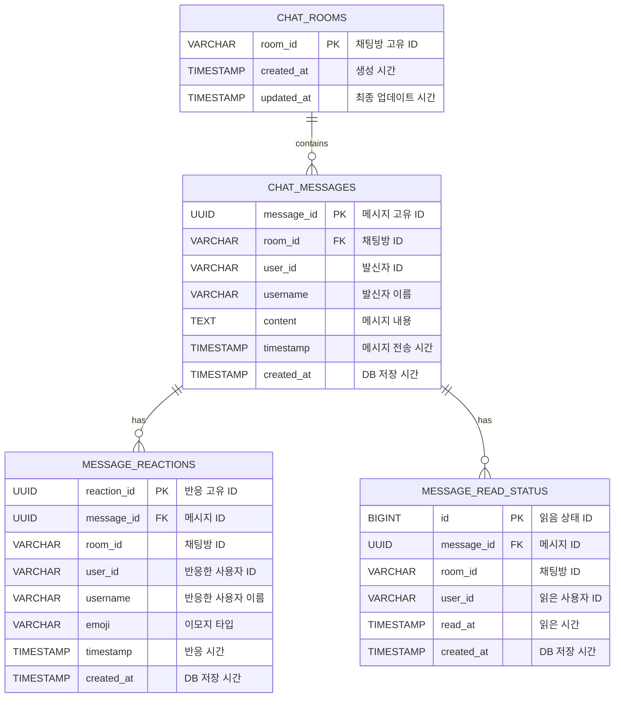
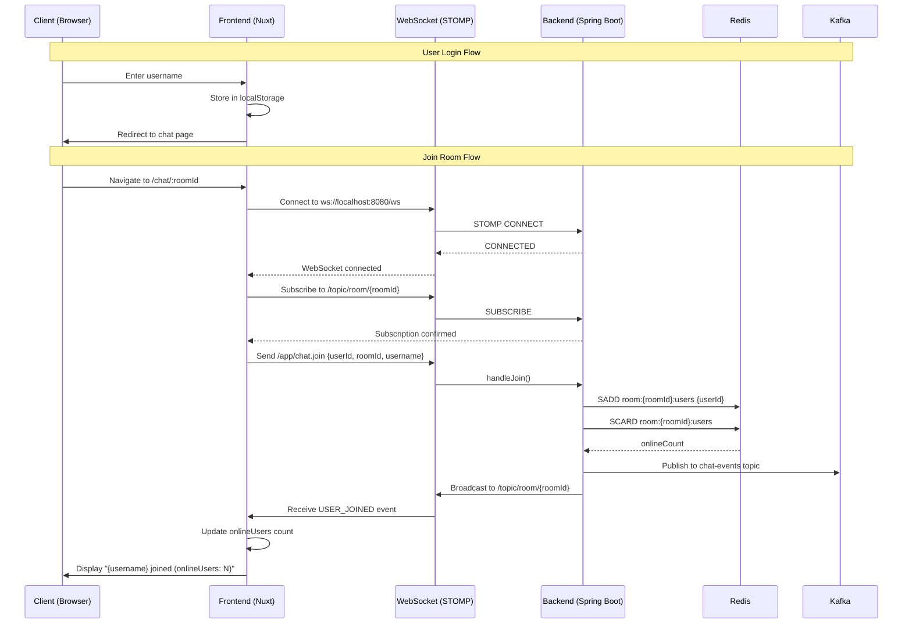
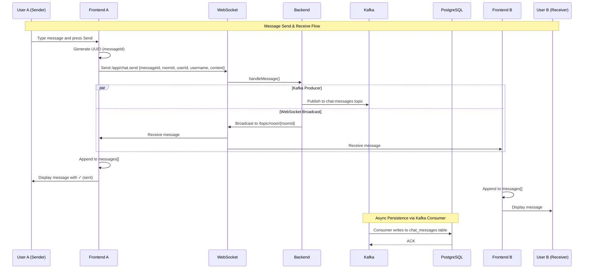
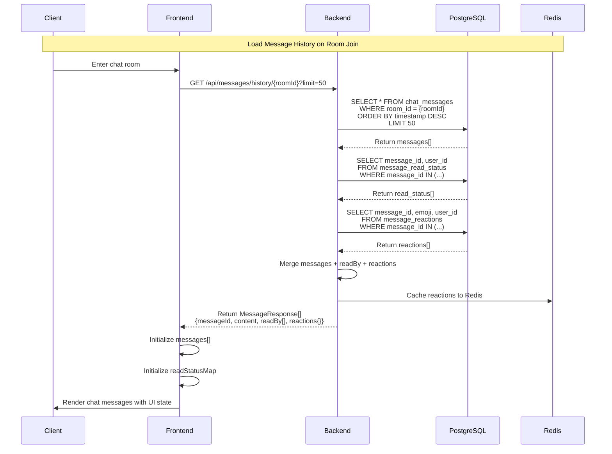
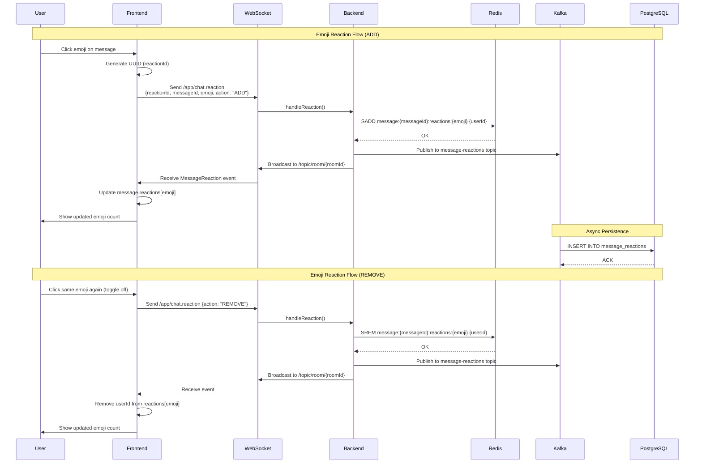
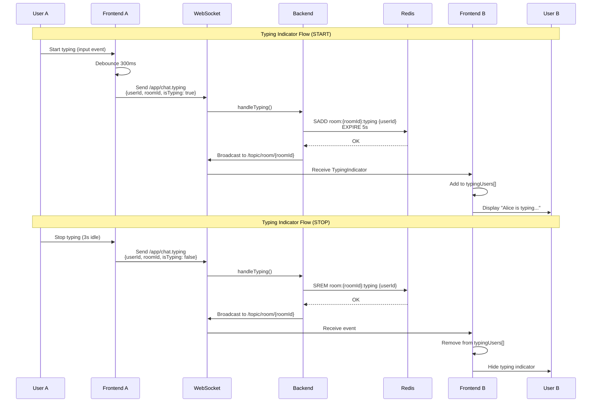
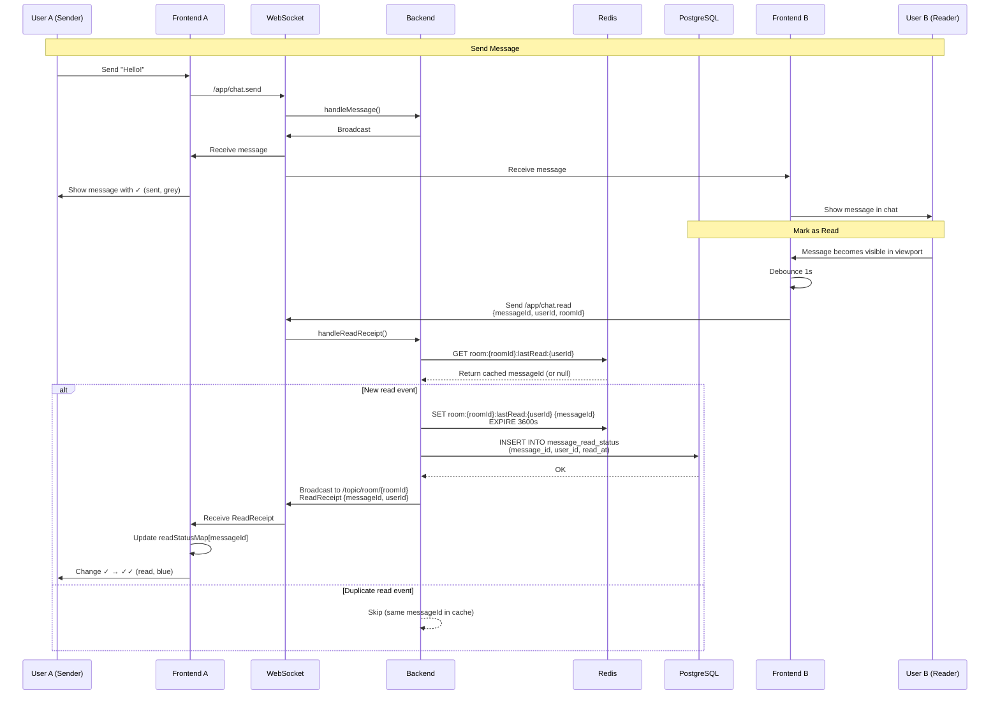
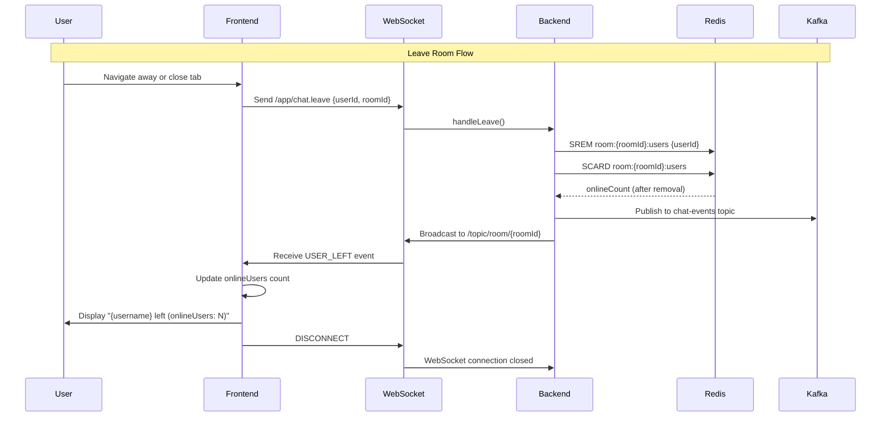

# nuxt-chat 시스템 아키텍처 문서

**프로젝트**: nuxt-chat (realtime-chat-1000)
**버전**: 1.0.0
**작성일**: 2026-01-23
**목표**: 동시접속 1000명을 지원하는 실시간 채팅 시스템

---

## 목차

1. [시스템 개요](#시스템-개요)
2. [기술 스택](#기술-스택)
3. [데이터베이스 ERD](#데이터베이스-erd)
4. [시퀀스 다이어그램](#시퀀스-다이어그램)
5. [요구사항 정의서](#요구사항-정의서)
6. [아키텍처 설계](#아키텍처-설계)

---

## 시스템 개요

### 프로젝트 목표

실시간 채팅 기능을 제공하며 동시접속자 1000명 이상을 지원하는 고성능 웹 채팅 애플리케이션

### 핵심 기능

- **실시간 메시징**: WebSocket (STOMP) 기반 양방향 통신
- **메시지 영구 저장**: PostgreSQL을 이용한 채팅 히스토리 보관
- **실시간 상태 관리**: Redis를 이용한 온라인 사용자, 타이핑 상태, 읽음 위치 캐싱
- **이모지 리액션**: Instagram 스타일 메시지 반응 기능
- **타이핑 인디케이터**: 실시간 타이핑 상태 표시
- **읽음 표시**: 메시지 읽음 상태 추적 및 체크마크 표시 (✓/✓✓)
- **이벤트 스트리밍**: Kafka를 통한 비동기 이벤트 처리

---

## 기술 스택

### Backend
- **Framework**: Spring Boot 3.x (Java 17+)
- **WebSocket**: STOMP over SockJS
- **Database**: PostgreSQL 15+
- **Cache**: Redis 7+
- **Message Queue**: Apache Kafka 3.x
- **Build Tool**: Gradle
- **Migration**: Flyway

### Frontend
- **Framework**: Nuxt 3 (Vue 3 Composition API)
- **Language**: TypeScript
- **Styling**: Tailwind CSS
- **WebSocket Client**: @stomp/stompjs
- **Build Tool**: Vite

### Infrastructure
- **Containerization**: Docker
- **Orchestration**: Docker Compose

---

## 데이터베이스 ERD

### 전체 ERD 다이어그램



### 테이블 상세 설명

#### 1. chat_rooms (채팅방)

| 컬럼명 | 타입 | 제약조건 | 설명 |
|--------|------|----------|------|
| room_id | VARCHAR(255) | PRIMARY KEY | 채팅방 고유 식별자 |
| created_at | TIMESTAMP | NOT NULL | 채팅방 생성 시간 |
| updated_at | TIMESTAMP | NOT NULL | 최종 업데이트 시간 |

**인덱스**:
- PRIMARY KEY: `room_id`

**비즈니스 규칙**:
- room_id는 사용자가 지정하는 문자열 (예: "general", "random")
- updated_at은 메시지가 전송될 때마다 갱신

---

#### 2. chat_messages (채팅 메시지)

| 컬럼명 | 타입 | 제약조건 | 설명 |
|--------|------|----------|------|
| message_id | UUID | PRIMARY KEY | 메시지 고유 식별자 |
| room_id | VARCHAR(255) | NOT NULL, FK | 채팅방 ID |
| user_id | VARCHAR(255) | NOT NULL | 발신자 ID |
| username | VARCHAR(255) | NOT NULL | 발신자 이름 |
| content | TEXT | NOT NULL | 메시지 내용 |
| timestamp | TIMESTAMP | NOT NULL | 메시지 전송 시간 |
| created_at | TIMESTAMP | NOT NULL | DB 저장 시간 |

**외래키**:
- `room_id` → `chat_rooms.room_id` (ON DELETE CASCADE)

**인덱스**:
- PRIMARY KEY: `message_id`
- `idx_messages_room_timestamp`: (room_id, timestamp DESC) - 채팅방별 최근 메시지 조회 최적화
- `idx_messages_user`: (user_id) - 사용자별 메시지 조회

**비즈니스 규칙**:
- message_id는 UUID v4 자동 생성
- timestamp는 클라이언트 전송 시간 (ISO 8601 형식)
- created_at은 DB 삽입 시간 (서버 시간)
- 채팅방 삭제 시 메시지도 연쇄 삭제 (CASCADE)

---

#### 3. message_reactions (메시지 반응)

| 컬럼명 | 타입 | 제약조건 | 설명 |
|--------|------|----------|------|
| reaction_id | UUID | PRIMARY KEY | 반응 고유 식별자 |
| message_id | UUID | NOT NULL, FK | 메시지 ID |
| room_id | VARCHAR(255) | NOT NULL | 채팅방 ID |
| user_id | VARCHAR(255) | NOT NULL | 반응한 사용자 ID |
| username | VARCHAR(255) | NOT NULL | 반응한 사용자 이름 |
| emoji | VARCHAR(20) | NOT NULL | 이모지 타입 |
| timestamp | TIMESTAMP | NOT NULL | 반응 시간 |
| created_at | TIMESTAMP | NOT NULL | DB 저장 시간 |

**외래키**:
- `message_id` → `chat_messages.message_id` (ON DELETE CASCADE)

**유니크 제약**:
- `unique_reaction`: (message_id, user_id, emoji) - 동일 사용자가 같은 메시지에 같은 이모지 중복 불가

**인덱스**:
- PRIMARY KEY: `reaction_id`
- `idx_reactions_message`: (message_id) - 메시지별 반응 조회
- `idx_reactions_user`: (user_id) - 사용자별 반응 조회

**비즈니스 규칙**:
- emoji 타입: HEART, LAUGH, WOW, SAD, THUMBS_UP, FIRE
- 한 사용자는 한 메시지에 여러 종류의 이모지 가능
- 한 사용자는 같은 이모지를 한 번만 추가 가능 (토글 방식)
- 메시지 삭제 시 반응도 연쇄 삭제 (CASCADE)

---

#### 4. message_read_status (메시지 읽음 상태)

| 컬럼명 | 타입 | 제약조건 | 설명 |
|--------|------|----------|------|
| id | BIGSERIAL | PRIMARY KEY | 읽음 상태 ID (자동 증가) |
| message_id | UUID | NOT NULL | 메시지 ID (논리적 FK) |
| room_id | VARCHAR(100) | NOT NULL | 채팅방 ID |
| user_id | VARCHAR(100) | NOT NULL | 읽은 사용자 ID |
| read_at | TIMESTAMP | NOT NULL | 읽은 시간 |
| created_at | TIMESTAMP | NOT NULL | DB 저장 시간 |

**유니크 제약**:
- `uk_message_user`: (message_id, user_id) - 동일 사용자가 같은 메시지 중복 읽음 방지

**인덱스**:
- PRIMARY KEY: `id`
- `idx_message_read_room_user`: (room_id, user_id) - 사용자별 읽음 위치 조회
- `idx_message_read_message`: (message_id) - 메시지별 읽은 사용자 조회
- `idx_message_read_timestamp`: (read_at) - 시간순 조회

**비즈니스 규칙**:
- 본인 메시지는 읽음 처리 안 함
- 중복 읽음 이벤트는 Redis 캐시로 필터링
- 메시지 삭제 시에도 읽음 상태 유지 (논리적 FK, NO ACTION)

---

### Redis 데이터 구조

#### 1. 온라인 사용자 (Set)

```
Key: room:{roomId}:users
Type: Set
TTL: None (명시적 삭제)
Value: ["user-123", "user-456", ...]

예시:
room:general:users = {"alice", "bob", "charlie"}
```

**용도**: 채팅방별 온라인 사용자 목록

---

#### 2. 타이핑 상태 (Set with TTL)

```
Key: room:{roomId}:typing
Type: Set
TTL: 5 seconds (자동 만료)
Value: ["user-123", ...]

예시:
room:general:typing = {"alice"}
```

**용도**: 현재 타이핑 중인 사용자 목록 (5초 후 자동 삭제)

---

#### 3. 메시지 리액션 (Hash)

```
Key: message:{messageId}:reactions
Type: Hash
TTL: 3600 seconds (1 hour)
Field: emoji
Value: JSON array of userIds

예시:
message:550e8400-e29b-41d4-a716-446655440000:reactions = {
  "HEART": ["alice", "bob"],
  "LAUGH": ["charlie"]
}
```

**용도**: 메시지별 이모지 반응 캐싱

---

#### 4. 읽음 위치 (String)

```
Key: room:{roomId}:lastRead:{userId}
Type: String
TTL: 3600 seconds (1 hour)
Value: messageId (UUID)

예시:
room:general:lastRead:alice = "550e8400-e29b-41d4-a716-446655440000"
```

**용도**: 사용자별 마지막 읽은 메시지 ID 캐싱 (중복 방지)

---

### Kafka 토픽

#### 1. chat-messages

```
Topic: chat-messages
Partitions: 10
Replication Factor: 1
Key: roomId
Value: ChatMessage (JSON)
```

**용도**: 채팅 메시지 이벤트 스트림 (PostgreSQL 영구 저장)

---

#### 2. chat-events

```
Topic: chat-events
Partitions: 3
Replication Factor: 1
Key: roomId
Value: ChatEvent (JSON)
```

**용도**: 사용자 입장/퇴장 이벤트 (분석 및 로깅)

---

#### 3. message-reactions

```
Topic: message-reactions
Partitions: 5
Replication Factor: 1
Key: messageId
Value: MessageReaction (JSON)
```

**용도**: 메시지 리액션 이벤트 (PostgreSQL 영구 저장)

---

## 시퀀스 다이어그램

### 1. 사용자 로그인 및 채팅방 입장



---

### 2. 메시지 전송 및 수신



---

### 3. 메시지 히스토리 로드 (초기 로딩)



---

### 4. 이모지 리액션 추가/제거



---

### 5. 타이핑 인디케이터



---

### 6. 메시지 읽음 표시 (Read Receipts)



---

### 7. 사용자 채팅방 퇴장



---

## 요구사항 정의서

### 기능 요구사항 (Functional Requirements)

#### FR-1. 실시간 메시징

| ID | 요구사항 | 우선순위 | 상태 |
|----|----------|----------|------|
| FR-1.1 | 사용자는 채팅방에 메시지를 전송할 수 있다 | 필수 | ✅ 완료 |
| FR-1.2 | 메시지는 실시간으로 모든 참여자에게 전달된다 (100ms 이하) | 필수 | ✅ 완료 |
| FR-1.3 | 메시지는 UUID로 고유 식별된다 | 필수 | ✅ 완료 |
| FR-1.4 | 메시지는 PostgreSQL에 영구 저장된다 | 필수 | ✅ 완료 |
| FR-1.5 | 사용자는 채팅방 입장 시 최근 50개 메시지를 조회할 수 있다 | 필수 | ✅ 완료 |

---

#### FR-2. 사용자 관리

| ID | 요구사항 | 우선순위 | 상태 |
|----|----------|----------|------|
| FR-2.1 | 사용자는 닉네임으로 간편 로그인할 수 있다 | 필수 | ✅ 완료 |
| FR-2.2 | 사용자는 채팅방에 입장/퇴장할 수 있다 | 필수 | ✅ 완료 |
| FR-2.3 | 사용자 입장/퇴장 시 다른 사용자들에게 알림이 전송된다 | 필수 | ✅ 완료 |
| FR-2.4 | 채팅방별 온라인 사용자 수가 실시간으로 표시된다 | 필수 | ✅ 완료 |
| FR-2.5 | 온라인 사용자 목록은 Redis Set으로 관리된다 | 필수 | ✅ 완료 |

---

#### FR-3. 이모지 리액션

| ID | 요구사항 | 우선순위 | 상태 |
|----|----------|----------|------|
| FR-3.1 | 사용자는 메시지에 이모지 반응을 추가/제거할 수 있다 | 필수 | ✅ 완료 |
| FR-3.2 | 지원 이모지: HEART, LAUGH, WOW, SAD, THUMBS_UP, FIRE | 필수 | ✅ 완료 |
| FR-3.3 | 한 사용자는 같은 메시지에 같은 이모지를 1번만 추가할 수 있다 (토글) | 필수 | ✅ 완료 |
| FR-3.4 | 이모지별 반응한 사용자 수가 표시된다 | 필수 | ✅ 완료 |
| FR-3.5 | 리액션은 실시간으로 모든 사용자에게 동기화된다 | 필수 | ✅ 완료 |
| FR-3.6 | 리액션 데이터는 Redis에 캐싱되고 PostgreSQL에 영구 저장된다 | 필수 | ✅ 완료 |

---

#### FR-4. 타이핑 인디케이터

| ID | 요구사항 | 우선순위 | 상태 |
|----|----------|----------|------|
| FR-4.1 | 사용자가 입력 중일 때 다른 사용자에게 "typing..." 표시 | 필수 | ✅ 완료 |
| FR-4.2 | 타이핑 상태는 300ms 디바운싱 적용 | 필수 | ✅ 완료 |
| FR-4.3 | 타이핑 상태는 3초 미입력 시 자동으로 해제된다 | 필수 | ✅ 완료 |
| FR-4.4 | 타이핑 상태는 Redis에 5초 TTL로 저장된다 | 필수 | ✅ 완료 |
| FR-4.5 | 최대 3명까지 타이핑 사용자 이름 표시 (예: "Alice, Bob, Charlie are typing...") | 선택 | ✅ 완료 |

---

#### FR-5. 읽음 표시 (Read Receipts)

| ID | 요구사항 | 우선순위 | 상태 |
|----|----------|----------|------|
| FR-5.1 | 사용자가 메시지를 읽으면 읽음 상태가 기록된다 | 필수 | ✅ 완료 |
| FR-5.2 | 본인 메시지에만 읽음 표시가 표시된다 | 필수 | ✅ 완료 |
| FR-5.3 | 메시지 상태: 전송됨(✓ 회색), 읽음(✓✓ 파란색) | 필수 | ✅ 완료 |
| FR-5.4 | 읽음 이벤트는 1초 디바운싱 적용 | 필수 | ✅ 완료 |
| FR-5.5 | 읽음 상태는 PostgreSQL에 영구 저장되고 Redis에 1시간 캐싱된다 | 필수 | ✅ 완료 |
| FR-5.6 | 중복 읽음 이벤트는 Redis 캐시로 필터링된다 | 필수 | ✅ 완료 |
| FR-5.7 | 메시지 히스토리 로드 시 읽음 상태도 함께 반환된다 | 필수 | ✅ 완료 |

---

### 비기능 요구사항 (Non-Functional Requirements)

#### NFR-1. 성능 요구사항

| ID | 요구사항 | 목표값 | 상태 |
|----|----------|--------|------|
| NFR-1.1 | 동시 접속자 수 | 1,000명 이상 | 🔄 테스트 필요 |
| NFR-1.2 | 메시지 전송 지연 시간 (p95) | 100ms 이하 | 🔄 테스트 필요 |
| NFR-1.3 | 메시지 유실률 | 0% | 🔄 테스트 필요 |
| NFR-1.4 | WebSocket 연결 안정성 (24시간) | 99.9% 이상 | 🔄 테스트 필요 |
| NFR-1.5 | 메시지 히스토리 로드 시간 (50개) | 200ms 이하 | ✅ 완료 |
| NFR-1.6 | Redis 캐시 히트율 | 90% 이상 | 🔄 모니터링 필요 |

---

#### NFR-2. 확장성 요구사항

| ID | 요구사항 | 설명 | 상태 |
|----|----------|------|------|
| NFR-2.1 | 수평 확장 가능 (Horizontal Scaling) | 서버 인스턴스 추가로 부하 분산 | 🔄 향후 구현 |
| NFR-2.2 | Kafka 파티셔닝 | roomId 기준 파티셔닝으로 순서 보장 | ✅ 완료 |
| NFR-2.3 | Redis 클러스터링 | 읽기/쓰기 부하 분산 | 🔄 향후 구현 |
| NFR-2.4 | PostgreSQL Read Replica | 읽기 성능 향상 | 🔄 향후 구현 |

---

#### NFR-3. 가용성 요구사항

| ID | 요구사항 | 목표값 | 상태 |
|----|----------|--------|------|
| NFR-3.1 | 서비스 가용성 (Uptime) | 99.9% (연간 8.76시간 다운타임 허용) | 🔄 모니터링 필요 |
| NFR-3.2 | 장애 복구 시간 (MTTR) | 15분 이내 | 🔄 정책 수립 필요 |
| NFR-3.3 | 데이터 백업 주기 | 일 1회 (PostgreSQL 스냅샷) | 🔄 향후 구현 |

---

#### NFR-4. 보안 요구사항

| ID | 요구사항 | 설명 | 상태 |
|----|----------|------|------|
| NFR-4.1 | XSS 방지 | 메시지 내용 HTML 이스케이핑 | ✅ 완료 |
| NFR-4.2 | SQL Injection 방지 | JPA/PreparedStatement 사용 | ✅ 완료 |
| NFR-4.3 | Rate Limiting | 메시지 전송 제한 (10msg/sec/user) | 🔄 향후 구현 |
| NFR-4.4 | WebSocket Origin 검증 | CORS 설정 | ✅ 완료 |

---

#### NFR-5. 유지보수성 요구사항

| ID | 요구사항 | 설명 | 상태 |
|----|----------|------|------|
| NFR-5.1 | 코드 커버리지 | 80% 이상 | 🔄 테스트 추가 필요 |
| NFR-5.2 | API 문서화 | OpenAPI/Swagger | 🔄 향후 구현 |
| NFR-5.3 | 로깅 표준화 | SLF4J + Logback | ✅ 완료 |
| NFR-5.4 | 모니터링 | Prometheus + Grafana | 🔄 향후 구현 |

---

## 아키텍처 설계

### 시스템 아키텍처 다이어그램

```
┌─────────────────────────────────────────────────────────────────┐
│                         Client (Browser)                        │
│  ┌──────────────────────────────────────────────────────────┐   │
│  │            Nuxt 3 Frontend (TypeScript)                  │   │
│  │  - Vue 3 Composition API                                 │   │
│  │  - Tailwind CSS (Instagram-style UI)                     │   │
│  │  - @stomp/stompjs (WebSocket Client)                     │   │
│  └──────────────────────────────────────────────────────────┘   │
└─────────────────────────────────────────────────────────────────┘
                              │
                              │ WebSocket (STOMP over SockJS)
                              │ HTTP/REST API
                              ▼
┌─────────────────────────────────────────────────────────────────┐
│                    Backend (Spring Boot 3)                      │
│  ┌──────────────────────────────────────────────────────────┐   │
│  │               WebSocket Layer (STOMP)                    │   │
│  │  - ChatWebSocketController                               │   │
│  │  - /app/chat.join, /app/chat.send, /app/chat.leave      │   │
│  │  - /app/chat.reaction, /app/chat.typing, /app/chat.read │   │
│  └──────────────────────────────────────────────────────────┘   │
│  ┌──────────────────────────────────────────────────────────┐   │
│  │                 REST API Layer                           │   │
│  │  - MessageHistoryController                              │   │
│  │  - GET /api/messages/history/{roomId}                    │   │
│  └──────────────────────────────────────────────────────────┘   │
│  ┌──────────────────────────────────────────────────────────┐   │
│  │                  Service Layer                           │   │
│  │  - KafkaProducerService                                  │   │
│  │  - RedisCacheService                                     │   │
│  │  - ReadReceiptService                                    │   │
│  │  - MessagePersistenceService                             │   │
│  └──────────────────────────────────────────────────────────┘   │
│  ┌──────────────────────────────────────────────────────────┐   │
│  │                Kafka Consumer Layer                      │   │
│  │  - ChatMessageConsumer                                   │   │
│  │  - ReactionConsumer                                      │   │
│  └──────────────────────────────────────────────────────────┘   │
└─────────────────────────────────────────────────────────────────┘
              │                  │                  │
              │                  │                  │
              ▼                  ▼                  ▼
    ┌────────────────┐  ┌────────────────┐  ┌────────────────┐
    │   PostgreSQL   │  │     Redis      │  │     Kafka      │
    │   (Messages)   │  │    (Cache)     │  │   (Events)     │
    │                │  │                │  │                │
    │ - chat_rooms   │  │ - online users │  │ - messages     │
    │ - messages     │  │ - typing state │  │ - events       │
    │ - reactions    │  │ - reactions    │  │ - reactions    │
    │ - read_status  │  │ - read cache   │  │                │
    └────────────────┘  └────────────────┘  └────────────────┘
```

---

### 데이터 흐름 (Data Flow)

#### 1. 메시지 전송 흐름

```
User A (Browser)
  → Frontend (Nuxt)
  → WebSocket STOMP /app/chat.send
  → Backend Controller (handleMessage)
  → Kafka Producer (chat-messages topic)
  ┌─→ WebSocket Broadcast (/topic/room/{roomId})
  │   → All connected clients in room
  │
  └─→ Kafka Consumer (async)
      → PostgreSQL (INSERT chat_messages)
```

---

#### 2. 읽음 상태 흐름

```
User B (reads message)
  → Frontend (Intersection Observer)
  → WebSocket STOMP /app/chat.read
  → Backend Controller (handleReadReceipt)
  → Redis (GET lastRead cache)
  │
  ├─ If NEW read event:
  │   → Redis (SET lastRead cache, TTL 1h)
  │   → PostgreSQL (INSERT message_read_status)
  │   → WebSocket Broadcast (ReadReceipt)
  │   → User A Frontend (update UI ✓ → ✓✓)
  │
  └─ If DUPLICATE read event:
      → Skip (no-op)
```

---

### 주요 설계 결정사항

#### 1. WebSocket vs HTTP Polling

**선택**: WebSocket (STOMP over SockJS)
**이유**:
- 양방향 실시간 통신 지원
- 서버 푸시 가능 (폴링 불필요)
- 낮은 지연 시간 (< 100ms)
- 연결 유지로 오버헤드 감소

---

#### 2. Kafka 사용 이유

**선택**: Apache Kafka
**이유**:
- 비동기 메시지 처리로 WebSocket 응답 속도 향상
- 메시지 순서 보장 (파티셔닝)
- 이벤트 소싱 및 감사 로그 (Audit Trail)
- 확장성 (파티션 추가로 처리량 증가)

---

#### 3. Redis 캐싱 전략

**선택**: Write-Through + TTL
**이유**:
- 읽음 위치: 1시간 TTL (최근 접속 사용자만 캐싱)
- 타이핑 상태: 5초 TTL (자동 만료)
- 리액션: 1시간 TTL + LRU 정책
- DB 부하 감소 (90% 캐시 히트율 목표)

---

#### 4. PostgreSQL vs NoSQL

**선택**: PostgreSQL
**이유**:
- ACID 트랜잭션 지원 (메시지 유실 방지)
- 복잡한 쿼리 지원 (JOIN, 집계)
- 메시지 히스토리 검색 용이
- 읽음 상태 추적 (복합 인덱스)

---

## 구현 완료 현황

### Phase 1-6 완료 기능

- [x] Phase 1: 기본 채팅 시스템 (WebSocket, Kafka, PostgreSQL, Redis)
- [x] Phase 2: 사용자 인증 및 채팅방 관리
- [x] Phase 3.1: Instagram 스타일 UI
- [x] Phase 3.2: 이모지 리액션 (HEART, LAUGH, WOW, SAD, THUMBS_UP, FIRE)
- [x] Phase 4: 메시지 히스토리 및 영구 저장
- [x] Phase 5: 타이핑 인디케이터
- [x] Phase 6: 읽음 표시 (Read Receipts)

---

## 향후 개선 사항

### Phase 7 (선택적)

- [ ] 파일 업로드 (이미지, 동영상)
- [ ] 메시지 검색 (Elasticsearch)
- [ ] 사용자 프로필 관리 (아바타, 상태 메시지)
- [ ] DM (Direct Message)
- [ ] 메시지 편집/삭제
- [ ] Push 알림 (Web Push API)
- [ ] 다크 모드

### 성능 최적화

- [ ] Spring Boot 서버 클러스터링 (Load Balancer)
- [ ] Redis Cluster (고가용성)
- [ ] PostgreSQL Read Replica
- [ ] CDN 적용 (정적 파일)
- [ ] gzip 압축

### 모니터링 및 운영

- [ ] Prometheus + Grafana
- [ ] ELK Stack (로그 수집 및 분석)
- [ ] Sentry (에러 트래킹)
- [ ] Health Check 엔드포인트 강화

---

## 문서 버전 히스토리

| 버전 | 날짜 | 작성자 | 변경 내용 |
|------|------|--------|-----------|
| 1.0.0 | 2026-01-23 | Claude Code | 초기 작성 - 전체 시스템 ERD, 시퀀스 다이어그램, 요구사항 정의서 |

---

## 참고 문서

- [Phase-6-Read-Receipts.md](./Phase-6-Read-Receipts.md)
- [Phase-5-Typing-Indicator.md](./Phase-5-Typing-Indicator.md)
- [Phase-3.2-Reaction-Feature.md](./Phase-3.2-Reaction-Feature.md)
- [PRD](./planning/01-prd.md)
- [TRD](./planning/02-trd.md)
